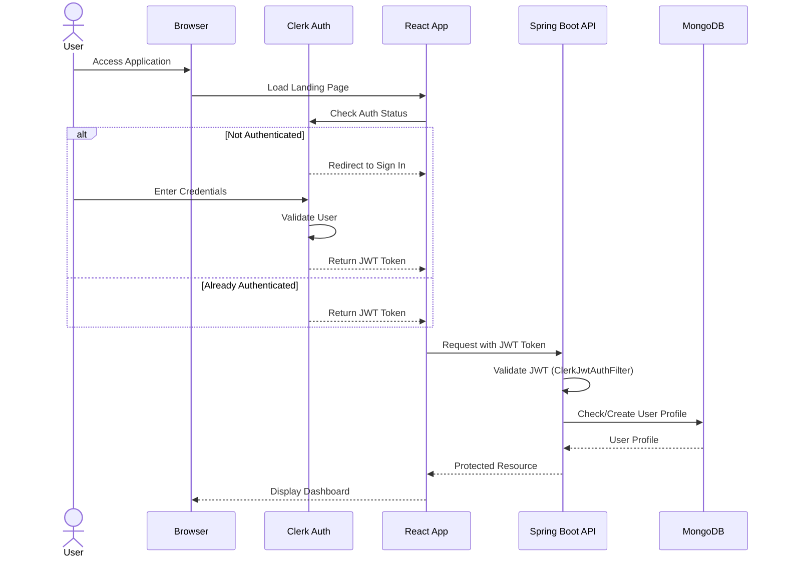
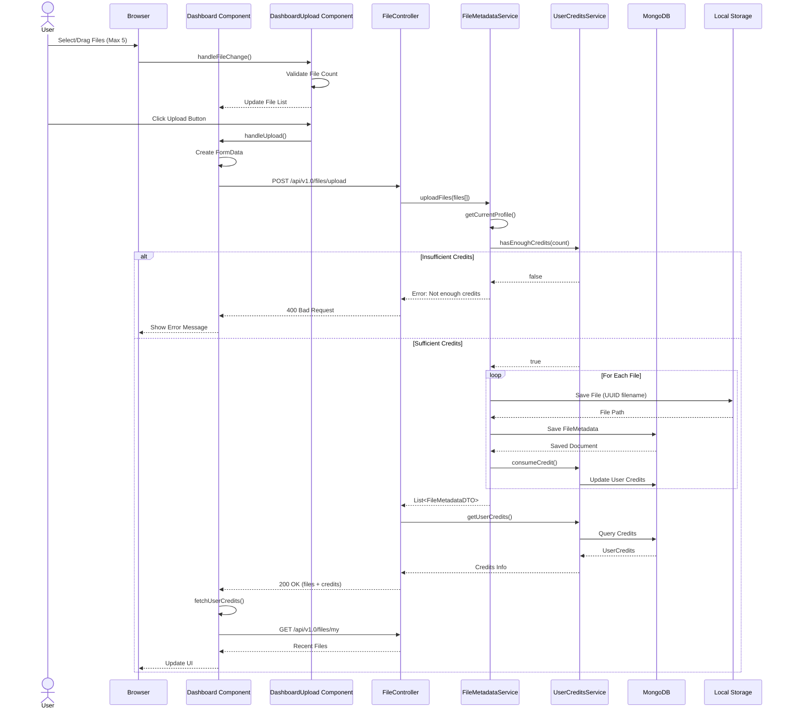
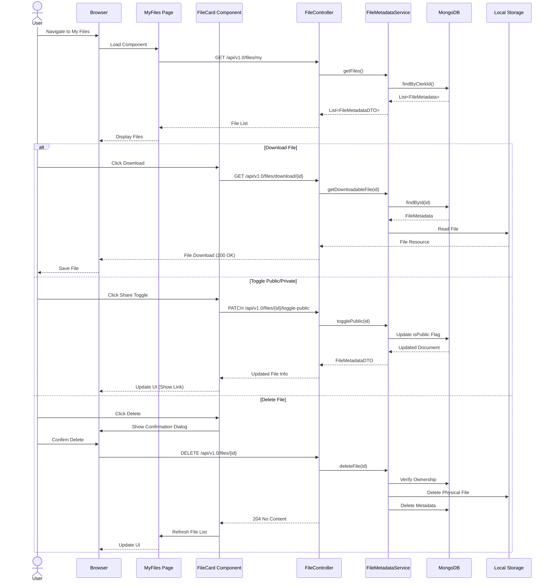
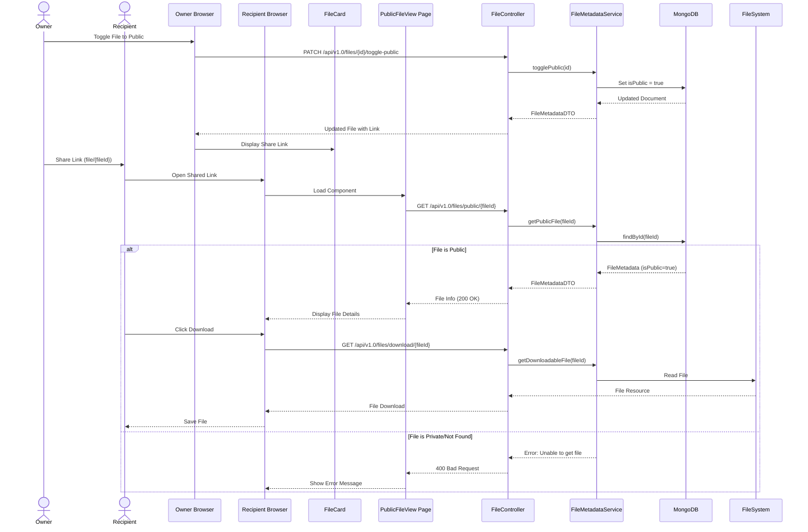
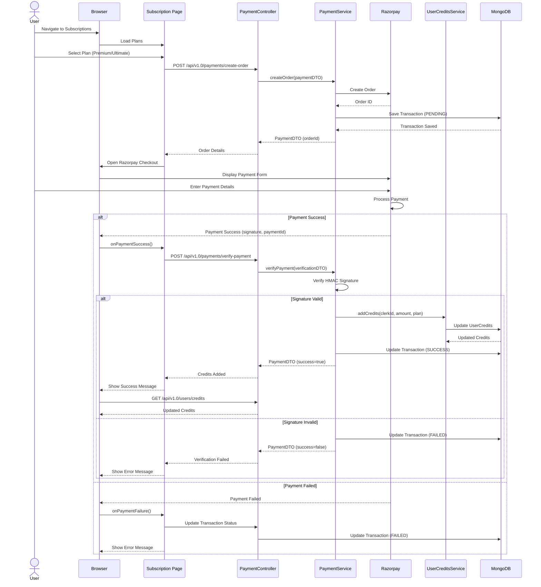
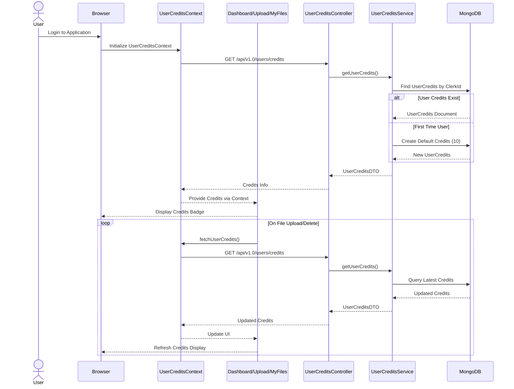
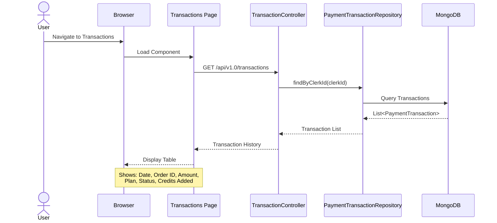

# CloudShare Application - Sequence Diagrams

## 1. User Authentication Flow

## 2. File Upload Flow

## 3. File Management Flow (View/Download/Delete/Share)

## 4. Public File Sharing Flow

## 5. Payment & Credits Flow

## 6. User Credits Monitoring Flow

## 7. Transaction History Flow

## Architecture Overview

### Frontend (React + Vite)
- **Authentication**: Clerk React SDK
- **State Management**: React Context (UserCreditsContext)
- **HTTP Client**: Axios
- **Routing**: React Router DOM
- **UI**: Tailwind CSS + Lucide Icons

### Backend (Spring Boot)
- **Security**: JWT Authentication (Clerk)
- **Database**: MongoDB
- **Payment Gateway**: Razorpay
- **File Storage**: Local File System
- **API**: RESTful endpoints

### Key Components

#### Frontend Pages
- Landing - Marketing page
- Dashboard - File upload & recent files
- MyFiles - File management
- Upload - Dedicated upload page
- Subscription - Plan selection & payment
- Transactions - Payment history
- PublicFileView - Public file access

#### Backend Controllers
- FileController - File operations
- PaymentController - Payment processing
- UserCreditsController - Credits management
- TransactionController - Transaction history
- ClerkWebhookController - Clerk events

#### Backend Services
- FileMetadataService - File business logic
- PaymentService - Payment & verification
- UserCreditsService - Credits management
- ProfileService - User profile management

#### Security
- ClerkJwtAuthFilter - JWT validation
- ClerkJwksProvider - Key management
- SecurityConfig - Security configuration
